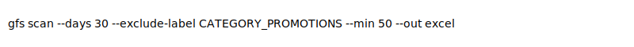

# Gmail Finance Scraper


Pull monetary amounts from your Gmail account into a spreadsheet.

## Quickstart

```bash
pipx install gmail-finance-scraper
gfs scan --days 30 --exclude-label CATEGORY_PROMOTIONS --min 50 --out excel
```

Or with Docker:

```bash
docker build -t gfs .
docker run --rm -v $PWD:/data gfs scan --days 30
```

## Web UI

```bash
streamlit run gmail_finance_scraper/web_ui.py
```



## Scopes

The scraper uses minimal read-only scopes:
- `https://www.googleapis.com/auth/gmail.readonly`
- `openid`
- `https://www.googleapis.com/auth/userinfo.email`

## How we parse amounts

Amounts are detected with a regex that looks for currency symbols and numbers. See `scanner.py` for the patterns.

## Sample output

```
| date                | sender_email | subject           | amount_value | amount_currency |
|---------------------|--------------|-------------------|--------------|----------------|
| 2024-01-01 10:00:00 | shop@foo.com | Your invoice      | 120.50       | USD            |
```

## Troubleshooting

- Ensure `credentials.json` is in the working directory.
- Delete cached tokens in `gmail_finance_scraper/tokens` if authentication fails.

## License

MIT
